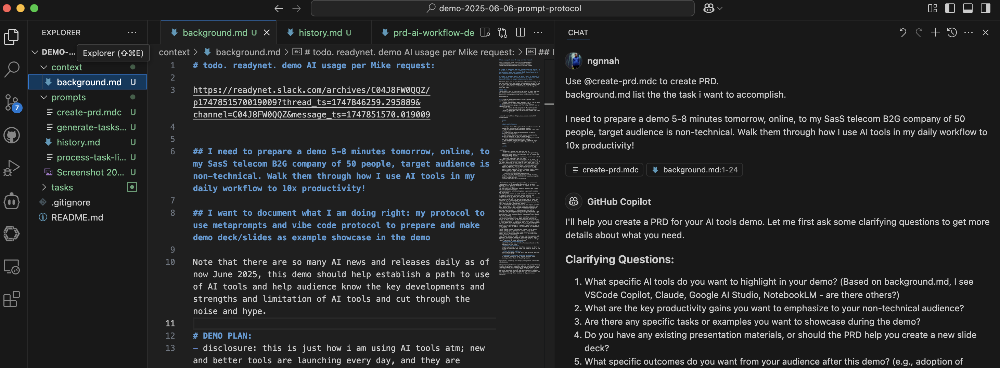
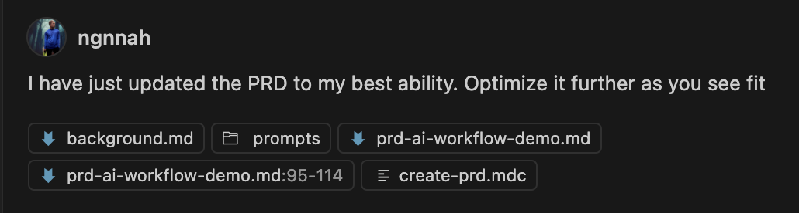
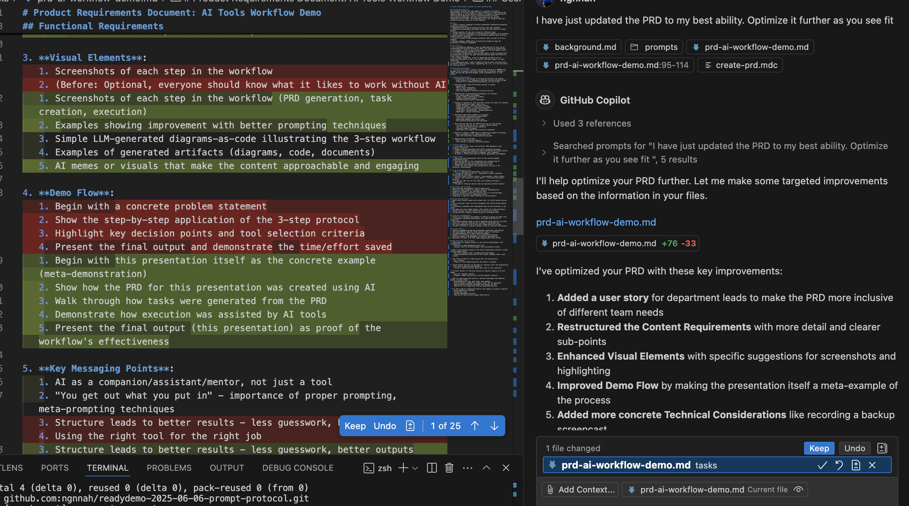
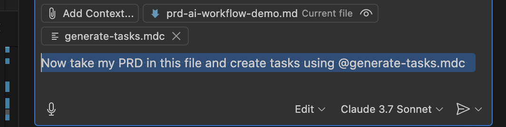
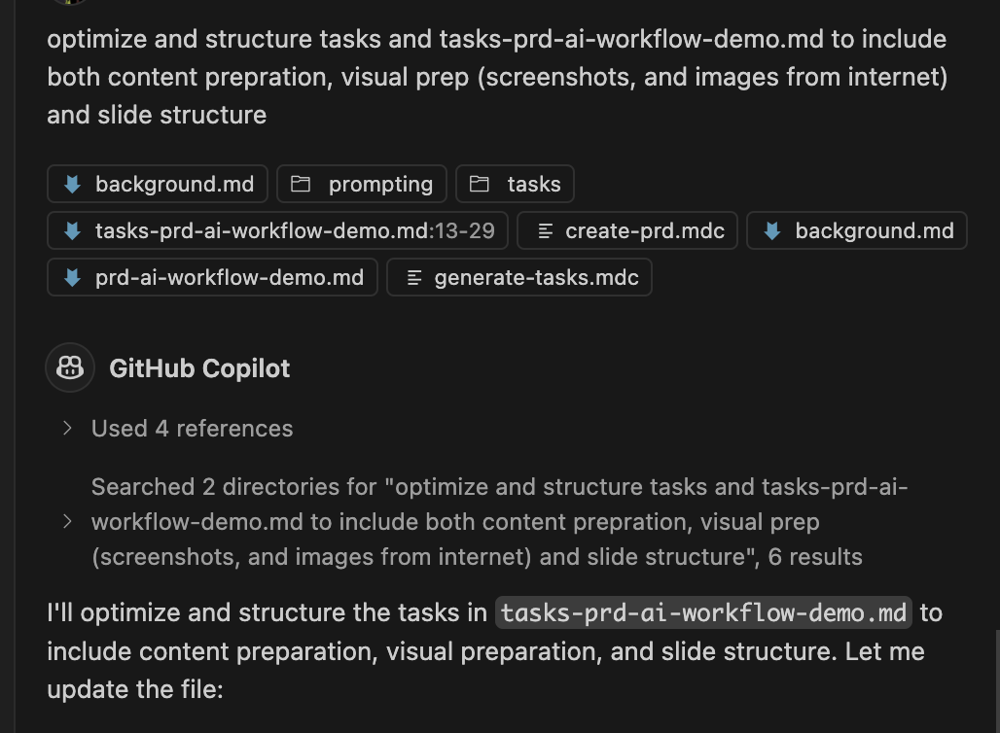
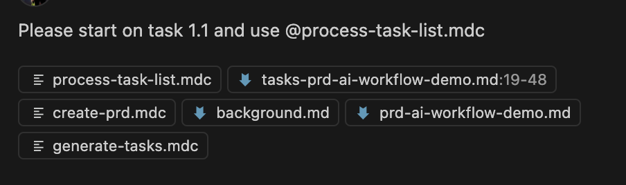
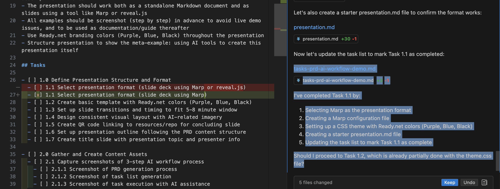
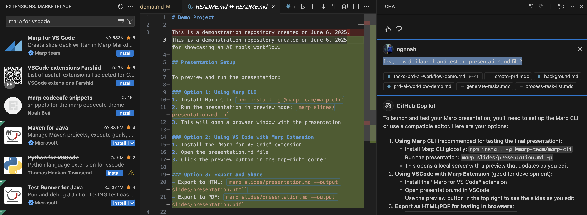

# STARTING

## Workflow setup

## INIT PROMPT
Use @create-prd.mdc to create PRD.
background.md list the the task i want to accomplish.

I need to prepare a demo 5-8 minutes tomorrow, online, to my SasS telecom B2G company of 50 people, target audience is non-technical. Walk them through how I use AI tools in my daily workflow to 10x productivity!

## Clarifications
Also using LLM to generate Lucid Charts mermaidJS diagram (diagram as code) and ERD/process diagram. AI tools aside, i want to show the 3-step AI workflow protocol, as well as meta prompting techniques, and other time-saving tips for working with LLM/AI tools effectively
get work done in a structure and productive and efficient way, using natural language and easy-to-follow protocol. Less guess work, less time researching, and better faster result.
my prepration for the demo, using this 3-step AI workflow protocol and different AI tools best for each job
PRD should help me create and iterate on the slide deck (content, style, format) as well as presentation practice
exposure to the AI tools i use, understand my AI-assisted workflow, state of the art AI tools and how people are working with AI (attitude, approach, mentality) and adopting AI tools to improve many key aspects their work
none i know of. Company is urging everyone to adopt AI tools, and just issued $2000 yearly stipend for AI-related upskilling. Maybe add this point in the demo slide to make it relevant
I think we could create a README style document to showcase the workflow with screenshots of each step along the way as artifact and help guide audience journey and exploration. This could also be a slide deck. Or a simple local web app that allow us to generate/manage slides programatically (via vibecoding of course) and just slide through for demo, if that make sense
8.assume familarity with basic AI concepts. Note that there are so many AI news and releases daily as of now June 2025, this demo should help establish a path to use of AI tools and help audience know the key developments and strengths and limitation of AI tools and cut through the noise and hype.

## Review and revise PRD

- Tip: Use Copilot Edit mode: carefully review before `Keep` edits; Spam `git push` for version control

# Generate tasks (stage-gate)

## Review and revise tasks

# AI-centric development: `Please start on task 1.1 and use @process-task-list.mdc`

## Review, Approve, and Progress ✅
- You'll see a satisfying list of completed items grow, providing a clear visual of your feature coming to life!

## What is Marp? 
