<!-- _class: title -->

# 🤖 Meta-Prompting X Vibe-Coding
## A Structured Approach to AI-Assisted Workflows

June 2025

---

## 🗺️ Presentation Overview

- 🚀 Introduction to AI-assisted workflows
- 💡 The 3-step AI workflow protocol
- ✨ Meta-prompting techniques
- 🛠️ AI tools for specific tasks
- 🌍 Real-world application examples
- ✅ Best practices and tips
- 💰 Your $2000 AI Upskilling Stipend
- ❓ Q&A

---

## 🔮 Introduction: AI Landscape in 2025

- 🌪️ Fast-paced AI tool releases & updates.
- 🧭 Essential to cut through the hype.
- 🧱 Need for a structured AI workflow.
- 🤝 AI as companion/assistant/mentor, not just a tool.

> "Garbage In, Garbage Out... Quality In, Quality Out!"

---

## 🤔 How I Created This Presentation

This demo itself is a product of the workflow:

1.  📝 Used the structured 3-step protocol.
2.  ✨ Applied meta-prompting techniques.
3.  🛠️ Leveraged multiple AI tools for specific tasks.
4.  📄 Documented each step for transparency.

---

## 💡 The 3-Step AI Workflow Protocol

A simple, powerful structure for AI-assisted development.

Source: 🔗 https://github.com/snarktank/ai-dev-tasks

---

## Step 1: 📜 Generate PRD (Product Requirements Document)

Starting with a clear goal, AI helps define the "what" and "why".

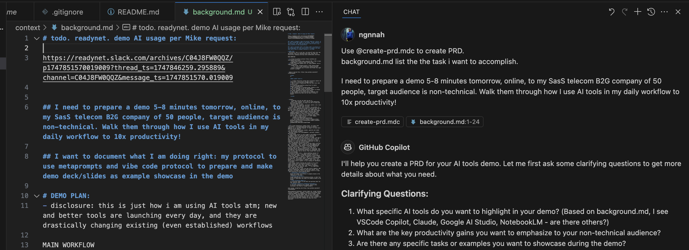

---

## Step 1.1: 🗣️ AI Asks Clarifying Questions

Before writing, the AI *must* ask questions to gather details:

- Key AI tools to feature?
- Productivity gains to highlight?
- Specific tasks to demonstrate?
- Presentation structure?

Clear answers lead to a better PRD.

---

## Step 1.2: ✅ Review and Revise PRD

- **Tip:** Use VSCode Copilot Edit mode for AI-assisted revisions.
  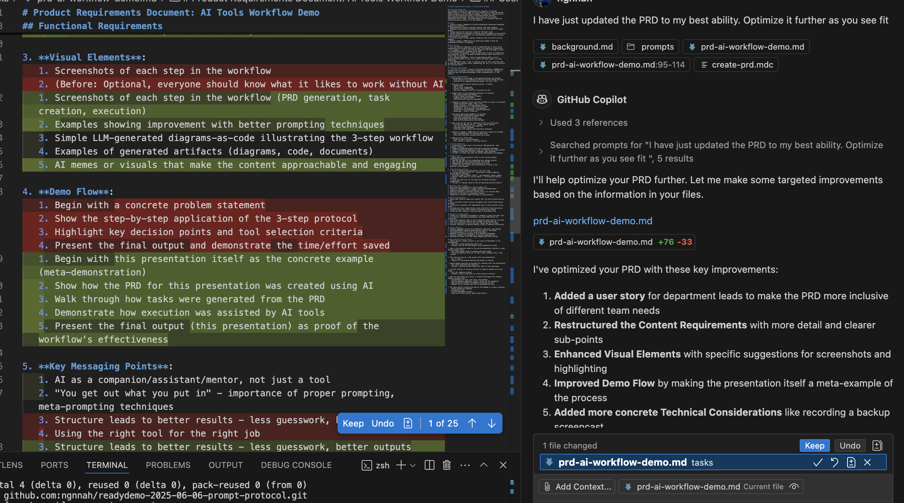
- **Crucial:** Carefully review AI suggestions before accepting.
  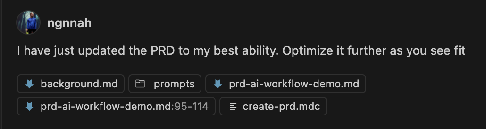
- **Best Practice:** Commit changes frequently (Git).

---

## Step 2: 📝 PRD to Actionable Tasks (Stage-Gate)

AI converts the PRD into a structured task list.

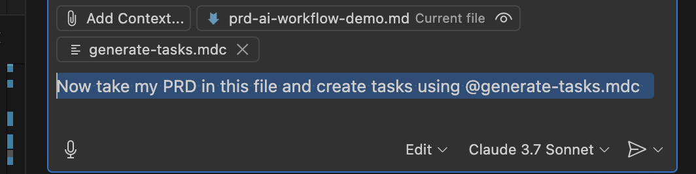

- Breaks down PRD into parent and sub-tasks.
- **Stage-gate:** Pause for user review before detailing sub-tasks.

---

## Step 2.1: ✅ Task List Refinement

- Optimized task structure for clarity.
- Included content creation, visual prep, and slide organization.
- Added specific details for each task component.

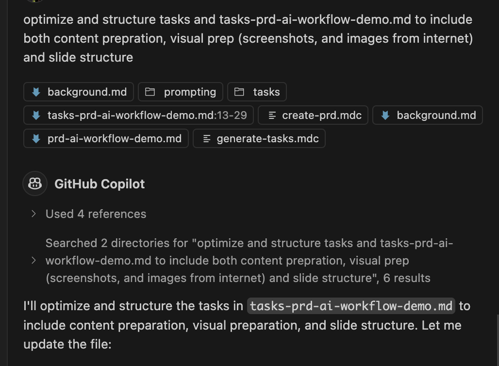

---

## Step 3: 🏃 Execute Tasks Step-by-Step

Work through the list, one task at a time, with AI assistance.

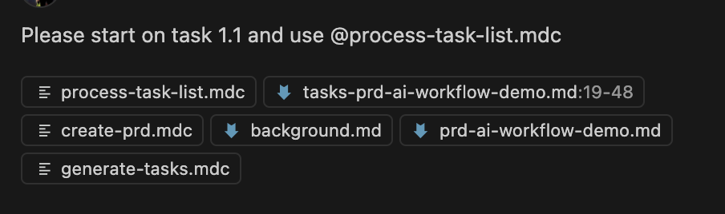

- Focus on one sub-task.
- AI helps with implementation.
- Mark tasks `[x]` as completed.

---

## Step 3.1: 📊 Tracking Progress

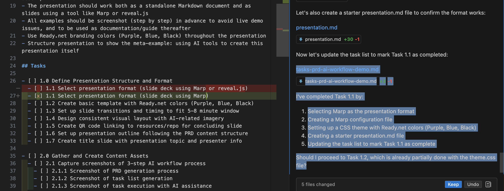

- ✅ Satisfying list of completed items grows.
- 🧱 Structured approach prevents getting lost.

---

## 🤔 What is Marp?

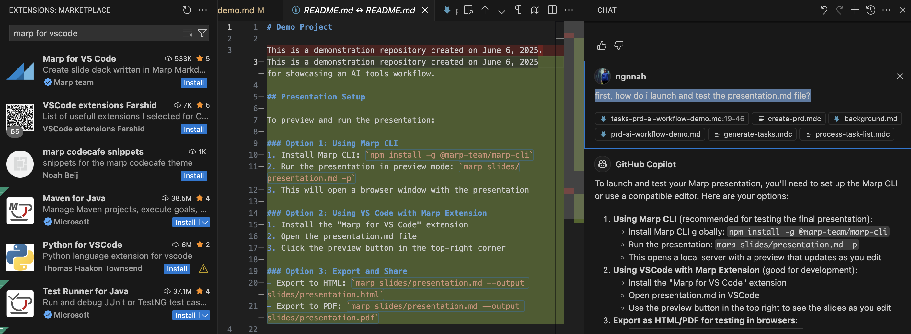

- 📄 **Markdown Presentation Ecosystem:** Create slides from simple text.
- 🤖 AI helped select Marp & assist with slide generation.

---

## 🔄 Converting WIP Docs to This Presentation

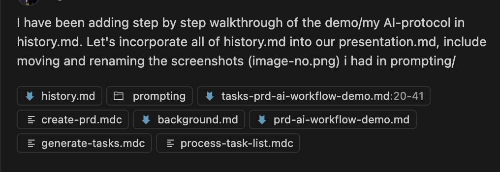

- 🗣️ Used a `history.md` (work-in-progress doc) as input.
- 🤖 AI transformed it into this structured presentation.
- ✨ **Meta-Example:** Using AI to document an AI workflow!

---

## ✨ Meta-Prompting Techniques

Let AI help you talk to AI more effectively!

- **System Prompts (XML):** Define AI's role & rules.
  <!-- Note for Task 2.3.1: Reference to Claude project "prompt-generator" -->
  <!-- Instructions to audience: Just ask "Craft a prompt to ____, ask clarification for best prompt" -->
  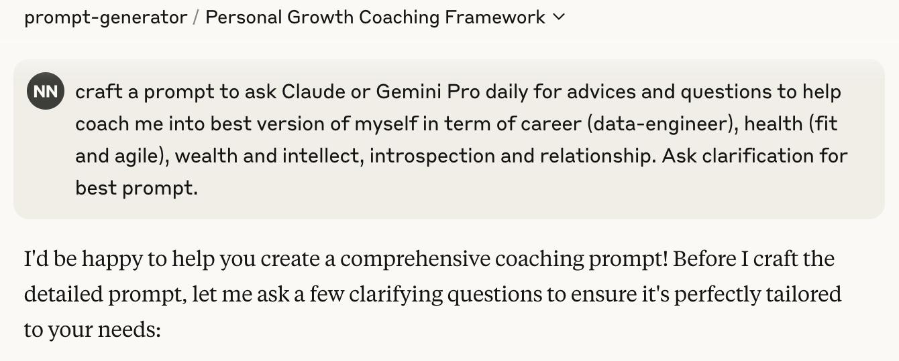
- **Prompt Folding:** Iterate and refine prompts with AI.
- **Provide `Examples`:** Show, don't just tell.
- **`Escape Hatches`:** Plan for graceful error handling.
- **Case Study:** [Data-Team Code Assist SysPrompt (Iterated)](../prompting/system-prompts/datateam-coding-assistant-sys-prompt-v7.md)

---

## 🛠️ Tool Selection for Specific Tasks

| Task                 | Tool                 | Why                                  |
| -------------------- | -------------------- | ------------------------------------ |
| ⚡ Coding      | VSCode Copilot       | Fast iteration, context-aware        |
| 🧠 Complex   | Google AI Studio     | Larger context windows, system prompt               |
| 📂 Context      | RepoPrompt           | Optimizes context for AI Studio    |
| ✍️ 1Prompt  | Claude | prompt-generator crafts superior prompts              |
| 🔎 Learn   | NotebookLM           | Discovers & connects sources         |
| 📊 Diagrams          | LLM → charts | Code to visual Lucid charts              |
| 📖 Docs | AI Studio 🔄 RepoPrompt | Vigorous intput-output cycle: Context matters most! |

---

## 🎯 Context is Key: Smart **INPUT** via RepoPrompt →

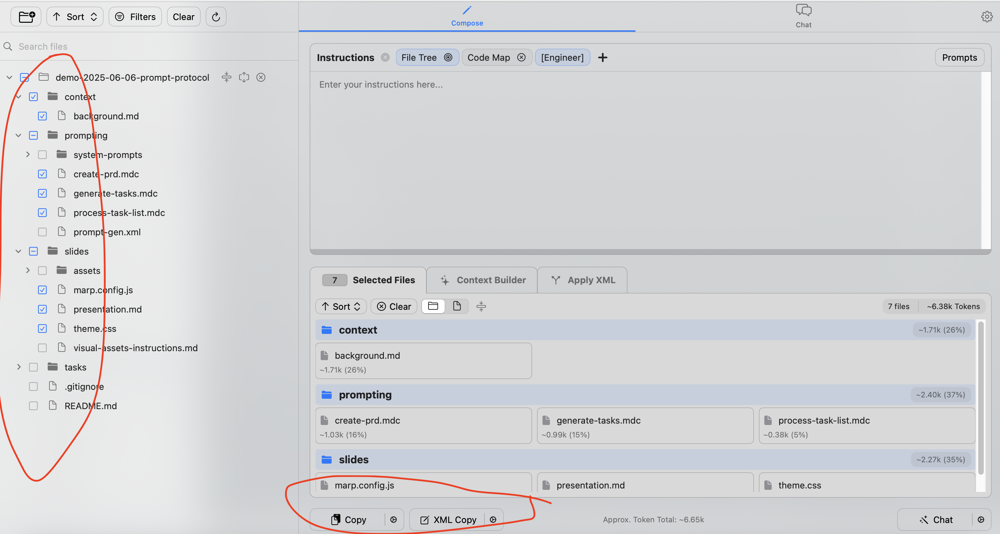

---

## 👑 King of Context: **Go Big** with AI Studio →

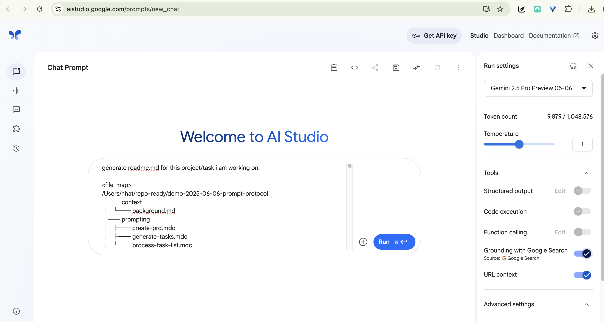

---

## 📚 Context is Knowledge: Auto-gen **OUTPUT**; Build Your Knowledge **Base**! →

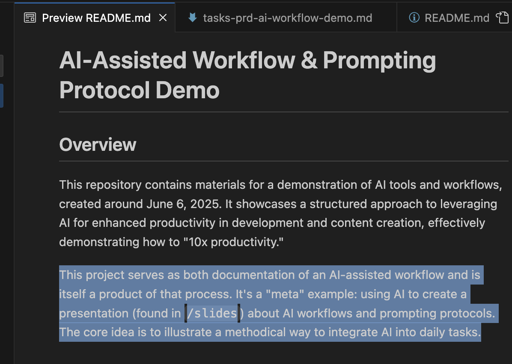

---

## 🌍 Real-World Applications

- 🎤 **This Presentation:** A meta-example of the workflow.
- ☁️ **Data Workflow/Calix Cloud:** From specs to diagrams to code.
- 📖 **Documentation:** AI-assisted guides with visuals.
- 🎨 **Image Generation (Gemini Canvas):** [Example Link](https://gemini.google.com/u/4/share/cb9103ca67d1)
    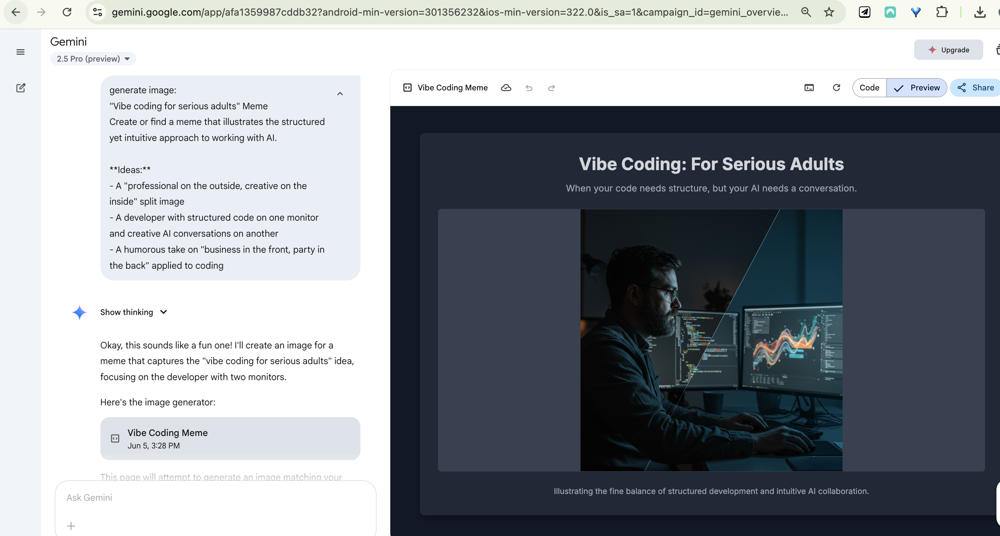

*All following the same structured 3-step protocol.*

---

## ☁️ Example: Data Workflow / Calix Cloud Integration

Linear requirements → schemas & diagrams (Lucidchart):
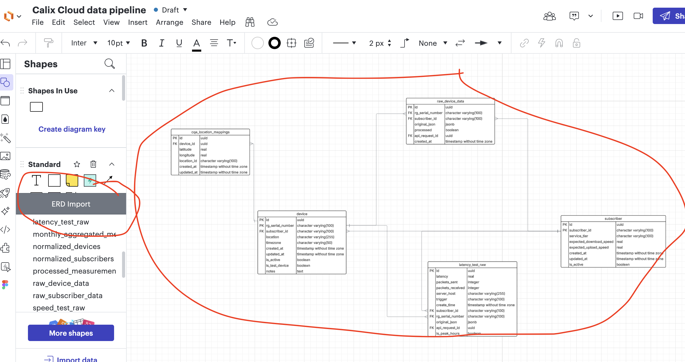 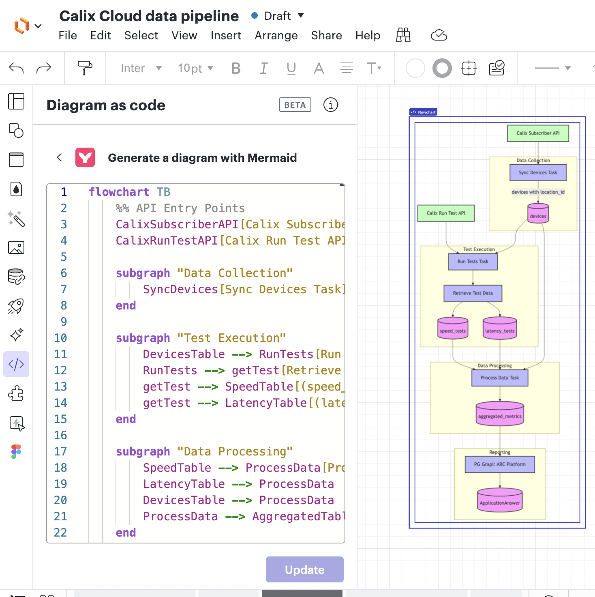

→ PRD and personal coding agent

---

## ✅ Best Practices for AI Tool Usage

- **Context is Crucial:** More detail = better AI results.
- **Right Tool, Right Job:** Match strengths to tasks.
- **Iterate on Prompts:** Refine based on AI outputs.
- **Structure Your Approach:** The 3-step protocol prevents chaos.
- **Embrace Meta-Prompting:** Let AI improve your prompts.

---

## 💰 Your $2000 AI Upskilling Stipend!

Invest in your AI skills - the company supports you!

- 🏢 **Offer:** $2000/year for AI tool learning & development.
- 📈 **Quick ROI Calculation:**
    - 1 hour saved/day = ~250 hours/year
    - At $50/hour (example rate) = **$12,500 value/year!**
    - That's a **~625% ROI** on the stipend!

---

## 🔑 Key Takeaways

1.  **Structure:** Transforms chaotic AI use into a reliable process.
2.  **Meta-Prompting:** Dramatically improves AI outputs.
3.  **Tool Choice:** Increases efficiency when matched to the task.
4.  **Context Quality:** "You get out what you put in."
5.  **AI Mindset:** Companion, assistant, mentor – not just a tool.

---

## 🙏 Final Acknowledgement

- This workflow is a continually evolving guide, not rigid dogma.
- Tools will change, but structured approaches remain valuable.
- You don't need to chase every new AI update to benefit greatly. Stay calm!

---

<!-- _class: title -->

# ❓ Q&A & Thank You! 🎉

- **Slides & Details:** `github.com/ngnnah/readydemo-2025-06-06-prompt-protocol/`
- **Follow-up:** Slack / GMeet (`nhat@ready.net`)

