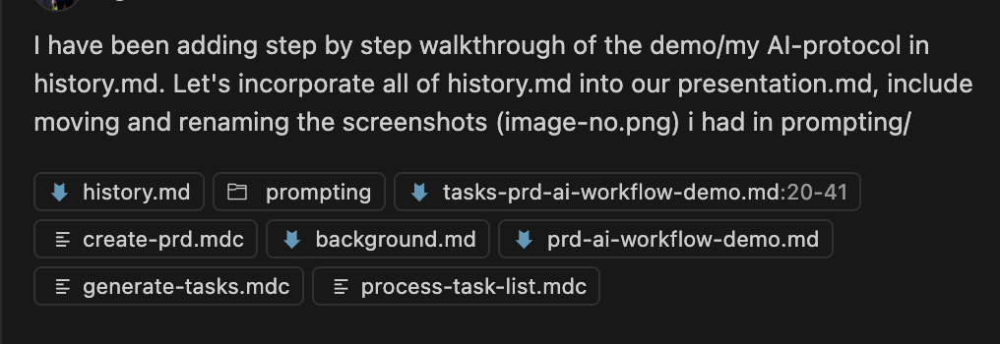
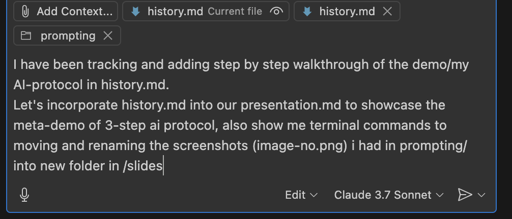

<!-- _class: title -->

# 10x Your Productivity with AI Tools
## A Structured Approach to AI-Assisted Workflows

June 2025

---

## Presentation Overview

- Introduction to AI-assisted workflows
- The 3-step AI workflow protocol
- Meta-prompting techniques
- AI tools for specific tasks
- Real-world application examples
- Best practices and tips
- $2000 yearly AI upskilling stipend
- Q&A

---

## Introduction: AI Landscape in 2025

- Overwhelming number of AI tools and daily updates
- Cutting through the hype is essential
- Need for structure in the AI workflow
- AI as companion/assistant/mentor, not just a tool

> "You get out what you put in"

---

## How I Created This Presentation

This presentation itself demonstrates the workflow I'll be showing you:

1. Used a structured 3-step protocol
2. Applied meta-prompting techniques
3. Leveraged multiple AI tools for specific tasks
4. Documented each step for you to see

---

## The 3-Step AI Workflow Protocol


Source: https://github.com/snarktank/ai-dev-tasks

---

## Step 1: Generate PRD


> Use @create-prd.mdc to create PRD.
> The file background.md describe the task I want to accomplish and my brainstorming

> I need to prepare a demo 5-8 minutes tomorrow to my SasS telecom B2G company of 50 people, 
> target audience is non-technical. Walk them through
how I use AI tools in my daily workflow to 10x productivity!

---

## Step 1: Clarifications

AI asked detailed questions to refine the PRD requirements:

1. What AI tools to highlight?
2. What productivity gains to emphasize?
3. What specific tasks to showcase?
4. How to structure the presentation?

Providing clear answers resulted in a comprehensive PRD.

---

## Step 1: Review and Revise PRD


- Tip: Use Copilot Edit mode in VSCode
- Carefully review before accepting edits
- Commit changes frequently for version control


---

## Step 2: PRD to Tasks (Stage-Gate)


> Now take my PRD in this file and create tasks
using @generate-tasks.mdc

- Convert PRD into actionable tasks
- Create hierarchy of parent and sub-tasks
- Stage-gate: Review before proceeding

---

## Step 2: Task List Review and Revise


- Optimized and structured tasks
- Included content preparation, visual prep, and slide structure
- Added specific details for each task component

---

## Step 3: Execute Tasks Step-by-Step


> Please start on task 1.1 and use @process-task-list.mdc

- Work on one task at a time
- Use AI to assist with implementation
- Mark tasks complete as you progress

---

## Step 3: Task Execution (cont.)


- Satisfying list of completed items grows
- Clear visual of your feature coming to life
- Structured approach prevents getting lost

---

## What is Marp?


- Markdown-based presentation tool
- Simple way to create slides from text
- AI helped select and implement the right tool

---

## Converting WIP Documentation to Presentation





- Used the history.md tracking document as input
- AI transformed it into a structured presentation
- Meta-example: Using AI to document AI workflow

---

## Meta-Prompting Techniques

- System prompt XML structure
- Prompt folding (iterating on prompts)
- Examples and escape hatches
- Evaluation is the crown jewel

```xml
<prompt>
  <context>
    Creating a presentation on AI workflows
  </context>
  <goal>
    Design a slide deck that explains my AI tools usage
  </goal>
  <instructions>
    Structure the presentation to show my 3-step workflow
    Include screenshots of the process
  </instructions>
</prompt>
```

---

## Tool Selection for Specific Tasks

| Task | Tool | Why |
| --- | --- | --- |
| Quick coding tasks | VSCode with Copilot/Edit | Fast iteration, context-aware |
| Complex context | Google AI Studio | Handles larger context windows |
| Better prompting | Claude Prompt Writer | Crafts comprehensive prompts |
| Research synthesis | NotebookLM | Discovers and connects sources |
| Diagrams | MermaidJS → Lucid Charts | Code to visual diagrams |
| Repo context | RepoPrompt | Optimizes code context |

---

## Real-World Applications

- **This presentation**: Meta-example of the workflow
- **Calix Cloud integration**: From requirements to diagrams
- **Data workflows**: dbt/Spark optimization with AI assistance
- **Documentation**: Auto-generating comprehensive guides

All following the same structured 3-step protocol

---

## Best Practices for AI Tool Usage

- **Provide proper context**: More detail = better results
- **Choose the right tool for the job**: Different strengths for different tasks
- **Iterate on prompts**: Refine based on initial outputs
- **Structure your approach**: 3-step protocol prevents chaos
- **Use meta-prompting**: Let AI help improve your prompts

---

## Your $2000 AI Upskilling Stipend

- Company offers $2000/year for AI tool learning
- Quick ROI calculation:
    - 1 hour saved per day = 250 hours/year
    - At $50/hour = $12,500 value
    - 625% ROI on the stipend!

---

## Key Takeaways

1. Structure transforms chaotic AI usage into reliable process
2. Meta-prompting techniques dramatically improve outputs
3. The right tool for the right job increases efficiency
4. "You get out what you put in" - context matters
5. AI as companion/assistant/mentor, not just a tool

---

<!-- _class: title -->

# Q&A

Scan for resources:
[QR code will be placed here]

---

<!-- _class: title -->

# Thank You!

Resources: https://github.com/snarktank/ai-dev-tasks
Contact: [Your contact information]