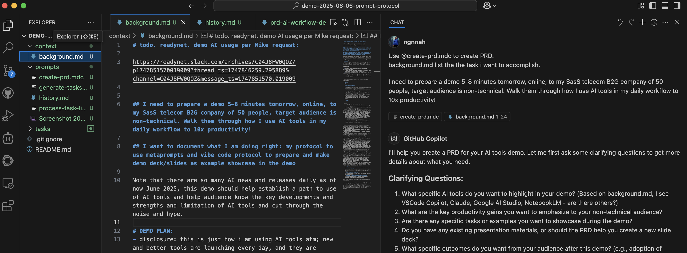
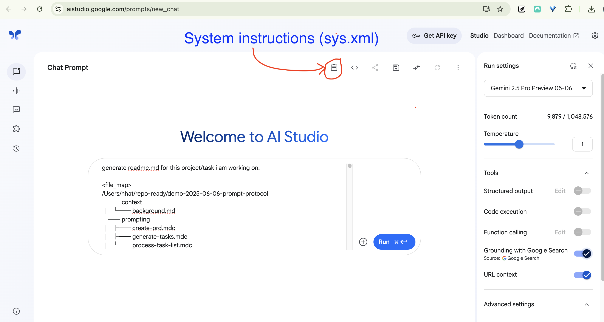

<!-- _class: title -->

# Meta-Prompting X Vibe-Coding
## A Structured Approach to AI-Assisted Workflows

June 2025

---

## Presentation Overview

- Introduction to AI-assisted workflows
- The 3-step AI workflow protocol
- Meta-prompting techniques
- AI tools for specific tasks
- Real-world application examples
- Best practices and tips
- $2000 yearly AI upskilling stipend
- Q&A

---

## Introduction: AI Landscape in 2025

- Overwhelming number of AI tools and breakneck updates
- Cutting through the hype is essential
- Need for structure in the AI workflow
- AI as companion/assistant/mentor, not just a tool

> "You get out what you put in"

---

## How I Created This Presentation

The demo itself:

1. Used a structured 3-step protocol
2. Applied meta-prompting techniques
3. Leveraged multiple AI tools for specific tasks
4. Documented each step for you to see

---

## The 3-Step AI Workflow Protocol

Source: https://github.com/snarktank/ai-dev-tasks

---

## Step 1: Generate PRD

---

## Step 1: Clarifications

AI asked detailed questions to refine the PRD requirements:

1. What AI tools to highlight?
2. What productivity gains to emphasize?
3. What specific tasks to showcase?
4. How to structure the presentation?

Providing clear answers resulted in a comprehensive PRD.

---

## Step 1: Review and Revise PRD
- Tip: Use Copilot Edit mode in VSCode

- Carefully review before accepting edits

- Commit changes frequently for version control

---

## Step 2: PRD to Tasks (Stage-Gate)

- Convert PRD into actionable tasks
- Create hierarchy of parent and sub-tasks
- Stage-gate: Review before proceeding

---

## Step 2: Task List Review and Revise

- Optimized and structured tasks
- Included content preparation, visual prep, and slide structure
- Added specific details for each task component

---

## Step 3: Execute Tasks Step-by-Step

- Work on one task at a time
- Use AI to assist with implementation
- Mark tasks complete as you progress

---

## Step 3: Task Execution (cont.)

- Satisfying list of completed items grows
- Clear visual of your feature coming to life
- Structured approach prevents getting lost

---

## What is Marp?

- Markdown-based presentation tool
- Simple way to create slides from text
- AI helped select and implement the right tool

---

## Converting WIP Documentation to Presentation

- Used the history.md tracking document as input
- AI transformed it into a structured presentation
- Meta-example: Using AI to document AI workflow

---

## Meta-Prompting Techniques

- System prompt XML structure

<!-- Note for Task 2.3.1: Reference to Claude project "prompt-generator" -->
<!-- Instructions to audience: Just ask "Craft a prompt to ____, ask clarification for best prompt" -->

  
- Prompt folding (iterating on prompts)
- Give `Examples` and `Escape hatches` (graceful exits, vents)
- Case-in-point: [data-team code-assist (many iterations!)](../prompting/system-prompts/datateam-coding-assistant-sys-prompt-v7.md)

---

## Tool Selection for Specific Tasks

| Task | Tool | Why |
| --- | --- | --- |
| Quick coding | VSCode Copilot | Fast iteration, context-aware |
| Complex context | Google AI Studio | Larger context windows |
| Repo context | RepoPrompt | Optimizes context for AI Studio |
| Better prompting | Claude Prompt Writer | Crafts better prompts |
| Research | NotebookLM | Discovers & connects sources |
| Diagrams | LLM → MermaidJS → Lucid | Code to visual diagrams |

---
## 🥇 Context is Key: Smart INPUT via RepoPrompt →

---
## King of Context: Go Big with AI Studio →

---
## Context is Knowledge: Auto-gen OUTPUT; Build Our Knowledge Base!

---

## Real-World Applications

- **This presentation**: Meta-example of the workflow
- **Data workflow/Calix Cloud integration**: From Linear requirements to diagrams, to Software Architect-AI, to Coding-AI
- **Documentation**: Generate comprehensive guides, with visuals
- Image generated with Gemini Canvas: [example](https://gemini.google.com/u/4/share/cb9103ca67d1)
    

All following the same structured 3-step protocol

---

## Data workflow/Calix Cloud integration
- Linear requirements → schemas and diagrams:
     

- → Coding agent

---

## Best Practices for AI Tool Usage

- **Provide proper context**: More detail = better results
- **Choose the right tool for the job**: Different strengths for different tasks
- **Iterate on prompts**: Refine based on initial outputs
- **Structure your approach**: 3-step protocol prevents chaos
- **Use meta-prompting**: Let AI help improve your prompts

---

## Your $2000 AI Upskilling Stipend

- Company offers $2000/year for AI tool learning
- Quick ROI calculation:
    - 1 hour saved per day = 250 hours/year
    - At $50/hour = $12,500 value
    - 625% ROI on the stipend!

---

## Key Takeaways

1. Structure transforms chaotic AI usage into reliable process
2. Meta-prompting techniques dramatically improve outputs
3. The right tool for the right job increases efficiency
4. "You get out what you put in" - context matters
5. AI as companion/assistant/mentor, not just a tool

---

## Final Acknowledgement

- This workflow isn't perfect, but it auto-scales
- Tools will evolve, but the structure remains valuable
- You don't need to track every AI update to benefit

---

<!-- _class: title -->

# Q&A +x Thank You!

- Slides and details: github.com/ngnnah/readydemo-2025-06-06-prompt-protocol/
- Follow-up: Slack, GMeet nhat@ready.net
